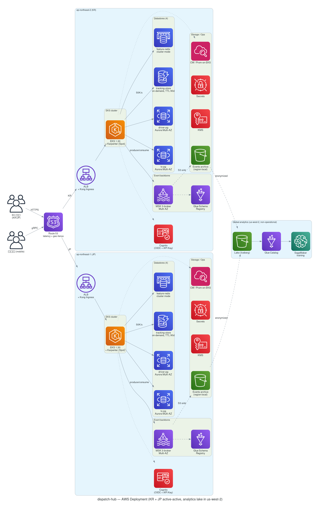
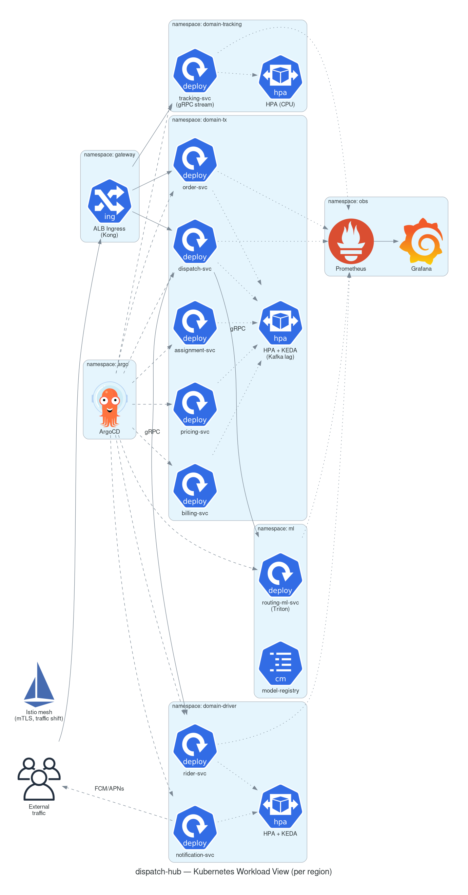

# dispatch-hub — Example Output

End-to-end artifacts (requirements → design + ADRs → diagrams) for a multi-region B2B last-mile dispatch SaaS. iac-gen is intentionally skipped for this example — the IaC pattern is already validated by `order-service`.

## Scenario

> B2B 실시간 라스트마일 배송 디스패치 플랫폼. 한국·일본 EC 기업과 라이더 회사들이 우리 API/Webhook으로 주문 넣으면 적정 라이더에게 자동 매칭/배차, 라이더 모바일 앱으로 작업 흐름 제공, 고객에게 실시간 위치 추적. 피크 일 50만 건, 라이더 5천 명 동시 위치 핑 50K/s, 99.95% SLA. 한국·일본 동시 운영, 데이터 주권 각 국가 보존. 결제 직접 X. 팀 35명. 회사 표준 K8s. ML로 경로 최적화.

핵심 사용자 요구: **도메인은 9개지만 DB는 더 적게** (결합도 낮은 도메인끼리 공유).

## What this example exercises (vs `order-service`)

| 축 | order-service | dispatch-hub |
|---|---|---|
| 규모 | 10K DAU, 200 TPS | 50K riders, 50K events/s |
| 팀 | 4명 | 35명 |
| 컴퓨트 | ECS Fargate | EKS + Karpenter |
| 이벤트 | SQS (per-channel) | MSK Kafka backbone |
| 리전 | 단일 | KR + JP active-active (per-country) |
| 데이터 주권 | KR only | per-country 분리 + 분석 일방향 |
| 도메인↔DB | 1:1 적합 | **다대일** consolidation (사용자 요구) |
| ML | 없음 | in-cluster Triton + SageMaker training |

## File tree

```
dispatch-hub/
├── requirements.md
├── context.json
├── design.md
├── docs/adr/
│   ├── 0001-compute-eks.md
│   ├── 0002-event-backbone-msk.md
│   ├── 0003-datastore-consolidation.md
│   └── 0004-multi-region-topology.md
└── diagrams/
    ├── context.{d2,svg}
    ├── container.{d2,svg}
    ├── deployment-aws.{py,png}
    └── deployment-k8s.{py,png}
```

## Diagrams

### System Context


### Container View (per region)


### AWS Deployment (KR + JP + analytics lake)


### Kubernetes Workload Zoom-in


## Architecture decisions

| # | Decision | Why this case |
|---|---|---|
| [ADR-0001](docs/adr/0001-compute-eks.md) | Compute = Amazon EKS | 회사 표준 K8s, 35명 팀이 K8s 생태계 OSS 적극 활용 |
| [ADR-0002](docs/adr/0002-event-backbone-msk.md) | Event backbone = Amazon MSK | 50K events/s + 9-도메인 이벤트 드리븐 + canonical Avro schema |
| [ADR-0003](docs/adr/0003-datastore-consolidation.md) | **4 datastores for 9 domains** | 사용자 명시 제약 — coupling 기반 consolidation |
| [ADR-0004](docs/adr/0004-multi-region-topology.md) | Per-country active, async global aggregation | 데이터 주권 (K-ISMS + APPI), 운영 데이터 cross-region 금지 |

## DB consolidation 표 (ADR-0003 요약)

| Store | Engine | Hosted domains |
|---|---|---|
| `tx-pg` | Aurora PG | Order, Dispatch, Assignment, Pricing, Billing |
| `driver-pg` | Aurora PG | Rider, RiderCompany, Notification |
| `tracking-store` | DynamoDB | TrackingEvent (TTL 90d) |
| `feature-redis` | Redis cluster | feature lookup, idempotency |

9 도메인 → 4 store. 각 PG 내부는 **schema 격리**로 도메인 자율성 유지. 트랜잭션 일관성 필요한 도메인 그룹(Order↔Dispatch↔Assignment↔Billing)이 같은 cluster 안에 있어 분산 saga 회피.

## Caveats

- 시뮬레이션 결과 — 실제 `/arch-designer:*` slash command 호출이 아님.
- 비용/성능 수치는 시나리오 가정값. 실 트래픽 측정 전제로 재산정 필요.
- KR-JP cross-border 라이더/주문은 open question으로 남김.
