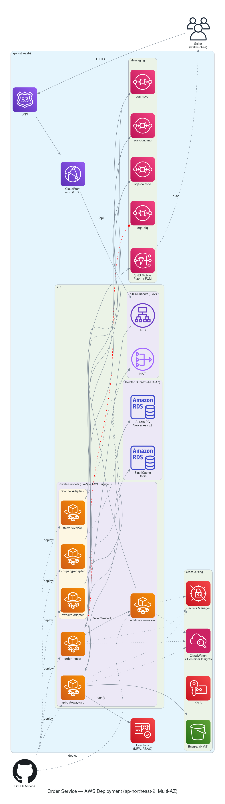
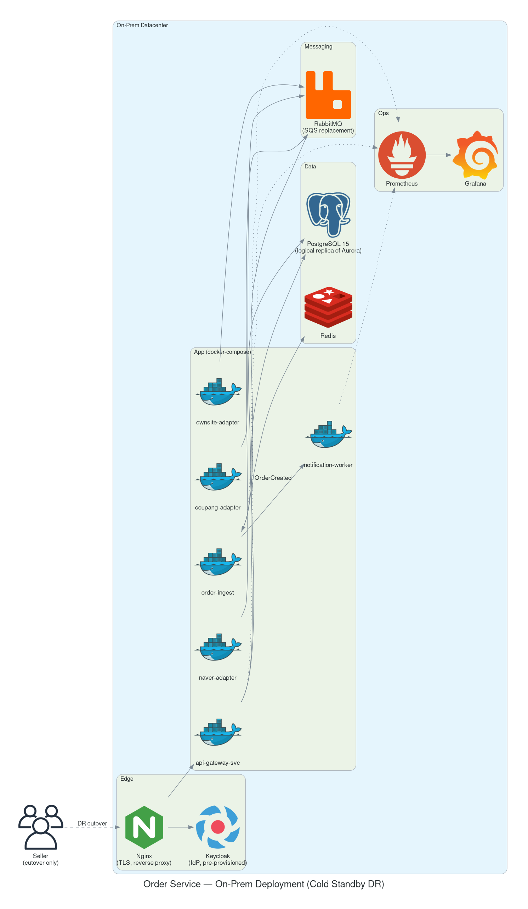

# order-service — Example Output

End-to-end artifacts for a Korean SMB multi-channel order management SaaS. Produced by running the full `arch-designer` pipeline against the scenario in [§ Scenario](#scenario).

## Scenario

> 주문 관리 SaaS. 한국 중소 셀러들이 쓸 거고, 자사몰/네이버 스마트스토어/쿠팡에서 들어오는 주문을 한 화면에서 본다. 웹 대시보드 + 셀러용 모바일 앱. 일 활성 사용자 1만 명 정도 예상, 피크는 점심/저녁. 결제는 직접 안 받고 외부 PG 호출만. 한국 리전 필수. 예산은 월 3000달러 안쪽. 팀은 4명, AWS 익숙. 일단 AWS로 가고 백업/DR은 온프렘 같이 검토.

That single paragraph is the only input to `gather-reqs`. Everything below is derived.

## Documents (human-readable)

마크다운으로 작성된 산출물. GitHub에서 바로 렌더링됩니다.

- 📋 [**requirements.md**](requirements.md) — 자유 서술 입력 → ISO/IEC 25010 8축으로 구조화된 요구사항. `stated` / `inferred` 태그로 명시값과 추정값 구분.
- 📐 [**design.md**](design.md) — arc42-lite 7섹션 (Goals / Constraints / Solution Strategy / Building Blocks / Runtime / Deployment / Decisions). 배포 뷰는 AWS + 온프렘 각각.
- 🧭 **Architecture Decision Records** (5개, Context / Decision / Consequences / Alternatives):
  - [ADR-0001: Compute = ECS Fargate](docs/adr/0001-compute-ecs-fargate.md)
  - [ADR-0002: Database = Aurora PG Serverless v2](docs/adr/0002-database-aurora-serverless-v2.md)
  - [ADR-0003: Channel adapters = event-driven workers](docs/adr/0003-channel-adapters-event-driven.md)
  - [ADR-0004: Authentication = Cognito](docs/adr/0004-auth-cognito.md)
  - [ADR-0005: Topology = Multi-AZ, single region](docs/adr/0005-deployment-multi-az-single-region.md)
- 🛠 **IaC + 리뷰 결과** — [`iac/aws/`](iac/aws/) (Terraform), [`iac/onprem/`](iac/onprem/) (docker-compose). 각 디렉토리의 README에 apply 절차와 의도된 제외사항이 적혀있음.

## File tree

```
order-service/
├── requirements.md                       # ISO/IEC 25010 8 axes, stated vs inferred
├── context.json                          # machine-readable state shared across skills
├── design.md                             # arc42-lite, 7 sections
├── docs/adr/
│   ├── 0001-compute-ecs-fargate.md
│   ├── 0002-database-aurora-serverless-v2.md
│   ├── 0003-channel-adapters-event-driven.md
│   ├── 0004-auth-cognito.md
│   └── 0005-deployment-multi-az-single-region.md
├── diagrams/
│   ├── context.{d2,svg}                  # D2 — system context
│   ├── container.{d2,svg}                # D2 — containers
│   ├── deployment-aws.{py,png}           # diagrams.py — AWS layout
│   └── deployment-onprem.{py,png}        # diagrams.py — on-prem DR
└── iac/
    ├── aws/                              # Terraform: VPC, ECS, Aurora, Cognito, SQS, ALB
    └── onprem/                           # docker-compose: PG, Redis, RabbitMQ, Keycloak, Nginx
```

## Diagrams

> `.d2` / `.py`는 텍스트 **소스**이고 `.svg` / `.png`가 렌더링 결과 (아래에 임베드). 소스를 보려면 같은 폴더의 `context.d2` 등을 열면 됨. 직접 편집 후 재렌더링은 [d2lang.com 플레이그라운드](https://play.d2lang.com), [VS Code D2 확장](https://marketplace.visualstudio.com/items?itemName=terrastruct.d2), 또는 `docker run terrastruct/d2:latest`.


### System Context (D2)


### Container View (D2)


### AWS Deployment (diagrams.py)


### On-Prem DR Deployment (diagrams.py)


## Architecture decisions

| # | Decision | Triggered by |
|---|---|---|
| [ADR-0001](docs/adr/0001-compute-ecs-fargate.md) | Compute = ECS Fargate | Performance + Maintainability + on-prem portability |
| [ADR-0002](docs/adr/0002-database-aurora-serverless-v2.md) | DB = Aurora PostgreSQL Serverless v2 | RPO 5min, spiky workload, K-ISMS |
| [ADR-0003](docs/adr/0003-channel-adapters-event-driven.md) | Channel adapters = isolated SQS workers | Fault isolation NFR + plugin extensibility |
| [ADR-0004](docs/adr/0004-auth-cognito.md) | Authn = Amazon Cognito | MFA + RBAC, team size |
| [ADR-0005](docs/adr/0005-deployment-multi-az-single-region.md) | Topology = Multi-AZ, single region | SLA 99.9% within $3K/mo budget |

Each ADR follows the Context / Decision / Consequences / Alternatives template. Every alternative table cites a concrete reason for rejection (no "industry standard" hand-waving).

## NFR coverage

`requirements.md` covers all 8 ISO/IEC 25010 axes with explicit `stated` / `inferred` tags. The user's free-form input addressed ~5 axes; the other 3 are `inferred` and surfaced in `## 4. Assumptions` for confirmation. NFR numeric values flow into `context.json.nfr` and drive downstream choices (e.g. RPO 5min → continuous backup → Aurora over RDS).

## IaC validation (iac-reviewer dry-run)

| Validator | Result |
|---|---|
| `terraform fmt -check -recursive` | pass (after 1 auto-fix) |
| `terraform init -backend=false` | pass — 5 modules resolved |
| `terraform validate` | pass |
| `docker compose config -q` | pass |

Findings surfaced for human attention:
- ALB needs ACM cert wired (deliberately commented in `main.tf`)
- `single_nat_gateway = true` is a cost trade-off — override for prod
- 5 ECS services beyond `api-gateway-svc` are the same pattern; stubbed with a NOTE rather than duplicated (avoid drift)
- See full report in commit history / `iac-reviewer` output

Estimated AWS monthly cost at the scenario's scale: **~$700** (vs $3000 ceiling).

## Caveats

- This output was produced by an LLM following the SKILL.md instructions in this repo. It is **not** the result of a real `/arch-designer:gather-reqs` invocation yet — the plugin install + slash-command flow is the next milestone.
- The Korean-language source paragraph drives mixed-language output (Korean prose with English technical terms). The plugin doesn't force one language; it follows the input.
- "Example" ≠ "production-ready." Treat these artifacts as a strong starting draft that a working architect would refine.
